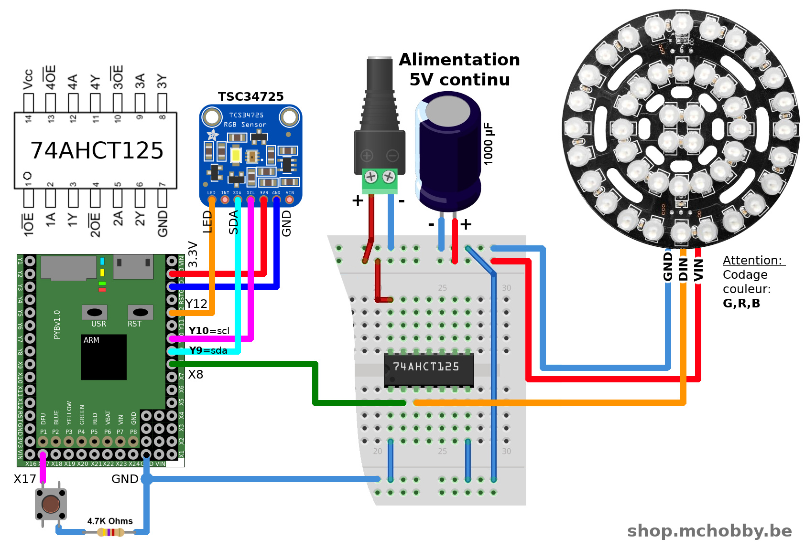

# Catch the color  
Use TCS34725 RGB sensor to capture an object color and replicate it to NeoPixels

"Color Catcher" is a reference to the "Dream Catcher" except it catch colors :-)

# Wiring

# Dependencies
This project relies on the following library
* ws2812.py : NeoPixel library [located here (esp8266-upy GitHub)](https://github.com/mchobby/esp8266-upy/tree/master/neopixel)
* tcs34725.py : Color sensor [located here (esp8266-upy GitHub)](https://github.com/mchobby/esp8266-upy/tree/master/tcs34725)

# Running
Just run the script `color_catcher.py` (or rename it as `main.py`).

Press the user button (or button on X17) to activate color catching, then white LED will lit and NeoPixel are updated with the catched color on the sensor.

Once ready and the color properly applied, press again the user button until the White LED shutoff.

The code is pretty simple, do not hesitate to read it.

__Please note__ that triple ring NeoPixel doesn't use the regular color encoding (RGB) but instead use the GRB order (and the code is adapted accordingly to that).

# Shopping list
* [Pyboard original](https://shop.mchobby.be/fr/micropython/570-micropython-pyboard-3232100005709.html) @ MCHobby.be
* [NeoPixel Triple ring](https://shop.mchobby.be/fr/nouveaute/1601-triple-anneau-neopixel-44-leds-neopixels-3232100016019-adafruit.html) @ MCHobby.be
* [Color sensor TCS34725](https://shop.mchobby.be/fr/autres-senseurs/1513-tcs34725-capteur-de-couleur-rgb-filtre-ir-led-blanche-3232100015135-adafruit.html) @ MCHobby.be
* [74AHCT125](https://shop.mchobby.be/fr/ci/1041-74ahct125-4x-level-shifter-3v-a-5v-3232100010413.html) @ MCHobby.be
* [Adapter DC plug (female)](https://shop.mchobby.be/fr/alim/235-adaptateur-d-alimentation-femelle-jack-vers-bornier-3232100002357.html)  @ MCHobby.be
