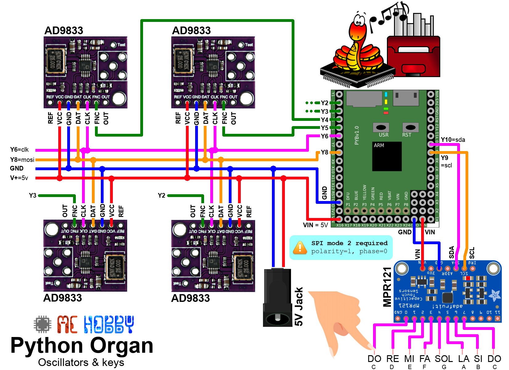
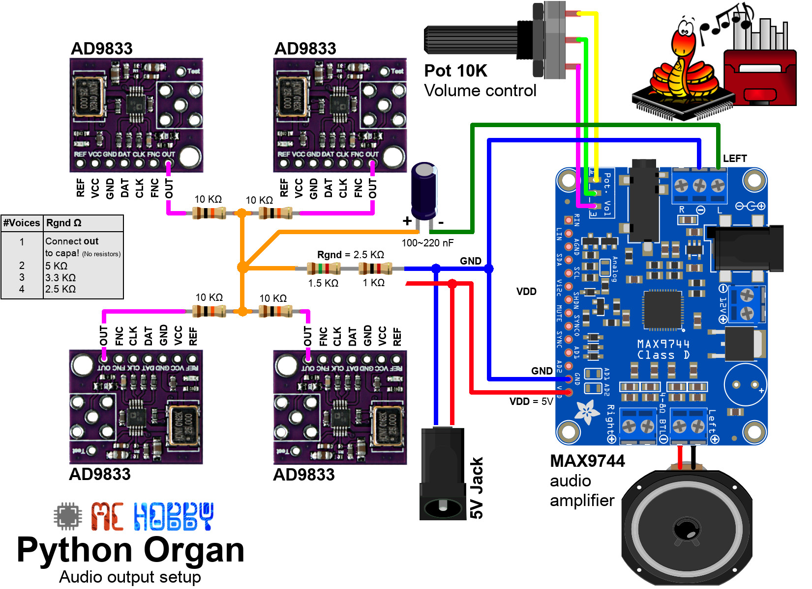

# Create a polyphonic organ with sinus generators, capactive sensor and MicroPython

Create a nice polyphonic instrument with SPI based oscillator.

Based on the "__Penny Organ__" Arduino project from Julian Ilett (see [this Youtube vidéo](https://youtu.be/2PehLon9X5k))

# Wiring

An external 5V jack is placed on the schematic to allow powering the organ with 5V wall PSU when development is finished.

__During development phase:__
* The 5V power should be removed from VDD pin (on amplifier) which allow the python-organ to be powered via the USB (without powering the amplifier which is current hungry).
* Amplifier can still be powered separately from its own Power Jack (__only if vdd has been removed!__)

# Dependencies
This project relies on the following library
* ad9833.py : sinus signal generator library [located here (esp8266-upy GitHub)](https://github.com/mchobby/esp8266-upy/tree/master/ad9833)
* mpr121.py : 12 keys capacitive sensor [located here (esp8266-upy GitHub)](https://github.com/mchobby/esp8266-upy/tree/master/mpr121)

# Running
Just run the script `python_organ.py` (or rename it as `main.py`).

__TO BE CONTINUED__

# Shopping list
* [Pyboard original](https://shop.mchobby.be/fr/micropython/570-micropython-pyboard-3232100005709.html) @ MCHobby.be
* [MPR121 breakout](https://shop.mchobby.be/fr/tactile-flex-pot-softpad/1685-capteur-capacitif-12-touches-mpr121-3232100016859-adafruit.html) @ MCHobby.be
* [AD9833 signal generator breakout](https://shop.mchobby.be/fr/breakout/1689-generateur-de-signal-sinus-triangle-clock-0-125-mhz-3232100016897.html) @ MCHobby.be
