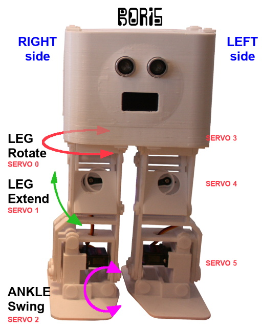

# Make Boris the Robot walking with with MicroPython

*** PROJECT UNDER CONSTRUCTION ***

Boris is a 3D walking robot designed and documented by [Sebastian Coddington (France) on its Robo Mecanacts YouTube channel](https://www.youtube.com/channel/UCWCROvDzBBwpPBE3Ex7JUDQ).

Sebastian explains how to print the robot, assemble it and propel it with Arduino.

This project will propel the robot with an [MicroPython Pyboard](https://shop.mchobby.be/fr/micropython/570-micropython-pyboard-3232100005709.html) and maybe a [MicroPython Pyboard-D](https://shop.mchobby.be/fr/micropython/1469-pyboard-d-sf2w-stm32f722iek-wifi-et-bluetooth-3232100014695.html) with native WiFi and Bluetooth support.

So the Arduino will be removed Boris and replaced with a MicroPython Pyboard.

# Building
Please follow the instructions on:
* [BORIS-the-Biped](https://www.instructables.com/id/BORIS-the-Biped-for-Beginners-and-Beyond/) @ instructable.com
* [Robomecanacts.com](http://www.robomecanacts.com/), the Sebastian Coddington WebSite with French and English instructions.
* [Sebastian Coddington (France) on its Robo Mecanacts YouTube channel](https://www.youtube.com/channel/UCWCROvDzBBwpPBE3Ex7JUDQ)

# Wiring the Pyboard to Boris

todo: place and wire the Pyboard into the Boris robot

The various servo-motors are wired to the PCA9685 PWM Driver (ADF-815) in the following order

## MORE
BLABLA

## MORE

BLABLA

# Dependencies
This project relies on the following library:
* pca9685.py + servoctrl.py : 12 channel PWM Controler based on PCA9685 [located here (ESP8266-upy GitHub)](https://github.com/mchobby/esp8266-upy/tree/master/pca9685)
* xxxx.py : xxx_description [located here (xxx GitHub)](https://github.com/mchobby/esp8266-upy/tree/master/COLORS)

# Running
Just run the script `boris.py` (or rename it as `main.py`).

If you use RShell with your Pyboard then your RTC clock is already on-time (RShell does it when it detect and register the Pyboard).

Otherwise, you have to use the RTC class (PYB module) to fix the current date and time.

# Ressources
* [Various movement for boris](https://youtu.be/UZgjnJScR_I) (_YouTube_)

# Shopping list
* Boris the Robot : STL,servo motors,etc. Please contact [Sebastian Coddington (France) on its Robo Mecanacts YouTube channel](https://www.youtube.com/channel/UCWCROvDzBBwpPBE3Ex7JUDQ)
* [Pyboard original](https://shop.mchobby.be/fr/micropython/570-micropython-pyboard-3232100005709.html) @ MCHobby.be
* other...
