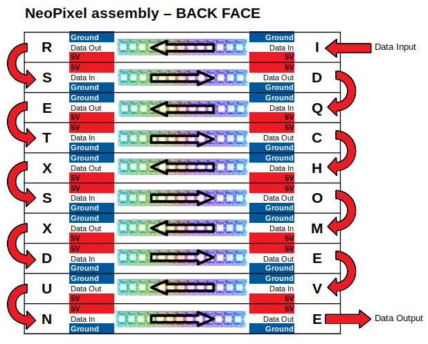

# Create a French word based clock with MicroPython

Create a work clock based on NeoPixels lighting letters cuts into a 18cm square face.

# Building
First, you need to download the CAD file and cut it with Laser Cutter. 
This CAD file format can be managed with the help of Fusion 360. 
This horloge-a-mots-decoupe-laser-1 CAD files are available from GrabCAD.com
* https://grabcad.com/library/horloge-a-mots-decoupe-laser-1

# Wiring

Remark: An external 5V 5A is required for smoother display and color-full illumination would required up to 7.5Amps.

## NeoPixels Assembly
We will use [NeoPixel strips with 60 LEDs/meter](https://shop.mchobby.be/fr/neopixels-et-dotstar/459-ruban-led-rgb-neopixel-60-leds-par-1m-noir-strip-3232100004597.html) to have a correct spacing between the LEDs and the letters.

With 10 lines of 11 LEDs/line => 110 LEDs (so 1.83 meters of strip).

The NeoPixel numbering will follow that scheme:

The Top-Left letter (I) will have the number 0. The R letter at position (x,y)=(4,2) will have the number 26.

Once wiredn the back of the word clock should look like this:

## Pyboard

# Dependencies
This project relies on the following library:
* noepixel.py : Using NeoPixel under MicroPython [located here (esp8266-upy GitHub)](https://github.com/mchobby/esp8266-upy/tree/master/neopixel)
* colors.py : color management and tool [located here (esp8266-upy GitHub)](https://github.com/mchobby/esp8266-upy/tree/master/COLORS)

# Running
Just run the script `work_clock.py` (or rename it as `main.py`).

If you use RShell with your Pyboard then your RTC clock is already on-time (RShell does it when it detect and register the Pyboard).

Otherwise, you have to use the RTC class (PYB module) to fix the current date and time.

# Shopping list
* [Pyboard original](https://shop.mchobby.be/fr/micropython/570-micropython-pyboard-3232100005709.html) @ MCHobby.be
* [NeoPixels Strip 60 LEDs/m](https://shop.mchobby.be/fr/neopixels-et-dotstar/459-ruban-led-rgb-neopixel-60-leds-par-1m-noir-strip-3232100004597.html) @ MCHobby.be
